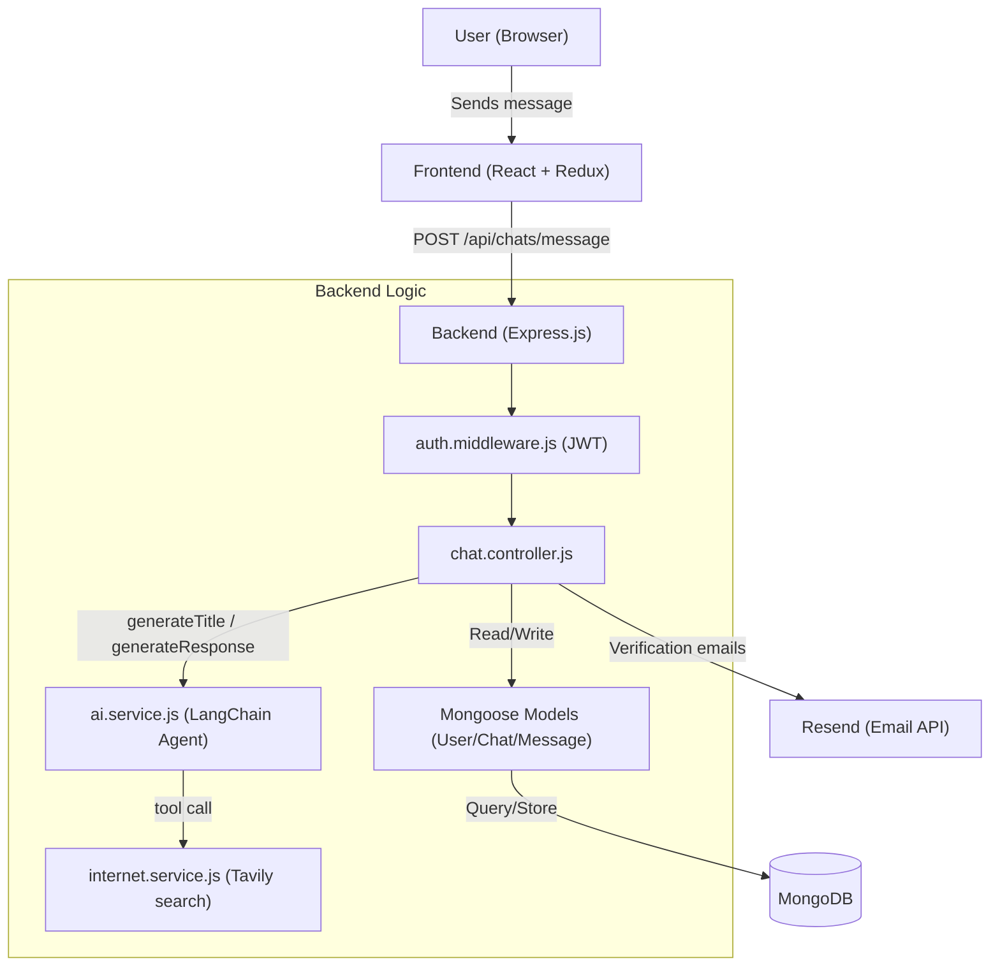

# Perplexity Clone

A full-stack AI-powered conversational search app inspired by Perplexity — ask a question, and the app searches the internet in real time and answers using an LLM agent, complete with chat history and streaming responses.

**Live demo:** https://perplexity-cyan-ten.vercel.app

The project is split into two apps:

- **Backend** — Node.js + Express API with a LangChain agent (Mistral/Gemini/OpenAI), Tavily web search as a tool, MongoDB for persistence, JWT auth with email verification, and Socket.IO wired in for real-time communication.
- **Frontend** — React (v19) + Vite, Redux Toolkit for state, Tailwind CSS for styling, `react-markdown` for rendering AI responses.

---

## How it works

1. A user sends a message to `POST /api/chats/message`.
2. If it's the first message in a conversation, the backend asks an LLM to generate a short chat title, and creates a new `Chat` document.
3. The user's message is saved, then the full message history for that chat is passed to a LangChain **agent** built on Mistral, which has access to a custom `searchInternet` tool (powered by Tavily) — so it can pull in live web results before answering.
4. The agent's reply is saved as an AI message and returned to the client.



---

## Tech Stack

**Backend:** Node.js, Express 5, MongoDB/Mongoose, JWT, Bcrypt, LangChain (`langchain`, `@langchain/core`), model providers (`@langchain/google-genai`, `@langchain/mistralai`, `@langchain/openai`), Tavily (`@tavily/core`) for web search, Socket.IO, Resend (transactional email), express-validator

**Frontend:** React 19, Vite, Redux Toolkit, React Router, Tailwind CSS 4, Framer Motion, react-markdown + remark-gfm, Socket.IO client, Lucide/Remix icons

---

## Authentication Flow

- **Register** — creates a user (password hashed via a Mongoose `pre("save")` hook), and sends a verification email via **Resend** with a JWT verification link.
- **Verify email** — `GET /api/auth/verify-email?token=...` validates the token and flips `user.verified` to `true`.
- **Login** — only allowed once `verified` is `true`; on success, a JWT is set as an HTTP-only cookie (`sameSite: 'none'`, `secure: true`) and also returned so it can be sent as a Bearer token.
- **Auth middleware** (`authUser`) accepts the token from either the cookie **or** an `Authorization: Bearer <token>` header, and attaches the decoded payload to `req.user`.

> Note: There's a commented-out Nodemailer/Gmail-OAuth2 implementation still in `mail.service.js`, kept as a fallback reference — it was replaced by Resend after SMTP issues in production. See `processOfNodemailer.md` in this repo if you want to switch back to Nodemailer.

---

## Repository Structure

```
perplexity/
├── backend/
│   ├── server.js
│   └── src/
│       ├── app.js
│       ├── config/
│       │   └── database.js
│       ├── controllers/
│       │   ├── auth.controller.js
│       │   └── chat.controller.js
│       ├── middleware/
│       │   └── auth.middleware.js
│       ├── models/
│       │   ├── user.model.js
│       │   ├── chat.model.js
│       │   └── message.model.js
│       ├── routes/
│       │   ├── auth.routes.js
│       │   └── chat.routes.js
│       ├── services/
│       │   ├── ai.service.js         # LangChain agent + model setup
│       │   ├── internet.service.js   # Tavily web search tool
│       │   └── mail.service.js       # Resend email sending
│       ├── sockets/
│       │   └── server.socket.js      # Socket.IO server init
│       └── validators/
│           └── auth.validator.js
├── frontend/
│   └── src/
│       ├── app/
│       │   ├── App.jsx
│       │   ├── app.store.js
│       │   └── index.css
│       └── main.jsx
├── processOfNodemailer.md   # Reference guide for Nodemailer + Gmail OAuth2 setup
└── README.md
```

---

## API Reference

### Auth — `/api/auth`

| Method | Endpoint          | Access  | Description                                   |
|--------|-------------------|---------|------------------------------------------------|
| POST   | `/register`       | Public  | Register a new user, sends a verification email |
| GET    | `/verify-email`   | Public  | Verify email via token query param (`?token=`)  |
| POST   | `/login`          | Public  | Log in (requires verified email); sets JWT cookie |
| GET    | `/get-me`         | Private | Get the current logged-in user's details        |
| POST   | `/logout`         | Private | Clear the auth cookie                           |

### Chats — `/api/chats` (all routes require login)

| Method | Endpoint                 | Description                                             |
|--------|---------------------------|----------------------------------------------------------|
| GET    | `/`                       | Get all chats for the current user                       |
| GET    | `/:chatId/messages`       | Get all messages in a specific chat                       |
| POST   | `/message`                | Send a message — creates a chat if `chatId` is not provided, gets an AI response |
| DELETE | `/delete/:chatId/`        | Delete a chat and all its messages                        |

---

## Getting Started

### Prerequisites

- Node.js (v18+ recommended)
- A MongoDB connection (local or Atlas)
- API keys for at least one LLM provider (Gemini and/or Mistral and/or OpenAI/OpenRouter)
- A [Tavily](https://tavily.com) API key for web search
- A [Resend](https://resend.com) API key for sending verification emails

### 1. Backend Setup

```bash
cd backend
npm install
```

Create a `.env` file in `backend/` with:

```env
MONGO_URI=your_mongodb_connection_string
JWT_SECRET=your_jwt_secret

# LLM providers (used by services/ai.service.js)
GEMINI_API_KEY=your_gemini_api_key
MISTRAL_API_KEY=your_mistral_api_key
OPENROUTER_API_KEY=your_openrouter_api_key

# Web search tool
TAVILY_API_KEY=your_tavily_api_key

# Transactional email
RESEND_API_KEY=your_resend_api_key

# URLs used in verification email links
BACKEND_URL=http://localhost:3000
FRONTEND_URL=http://localhost:5173
```

Start the backend:

```bash
npm run dev
```

The server runs at `http://localhost:3000`.

### 2. Frontend Setup

```bash
cd frontend
npm install
npm run dev
```

By default the frontend expects the backend to be reachable — check `frontend/src` for the base API URL used by Axios/Socket.IO client and point it at `http://localhost:3000` for local development.

### 3. Database

Make sure MongoDB is reachable (Atlas IP whitelist, or a local `mongod` instance) before starting the backend.

---

## Known Limitations / Notes

- **Test route left in `app.js`** — there's a leftover `POST /test` debug route on the root app; safe to remove before shipping further changes.
- **No automated test suite** (`npm test` is just the default placeholder script).
- **CORS origins are hardcoded** in both `app.js` and `server.socket.js` — update these arrays if you deploy to a new frontend URL.
- **Nodemailer/Gmail OAuth2 is disabled** in favor of Resend (see `mail.service.js` and `processOfNodemailer.md`) due to SMTP failures on the previous hosting provider.
- **No `.env.example` file** — use the variable list above as your template.
- One model in `ai.service.js` (`generateResponse` using the LangChain agent) does the heavy lifting; a simpler, non-agent Gemini implementation is present but commented out as a fallback reference.

---

## License

No license file is currently included in this repository. Add a `LICENSE` file if you intend to open-source this project under a specific license (e.g., MIT).


